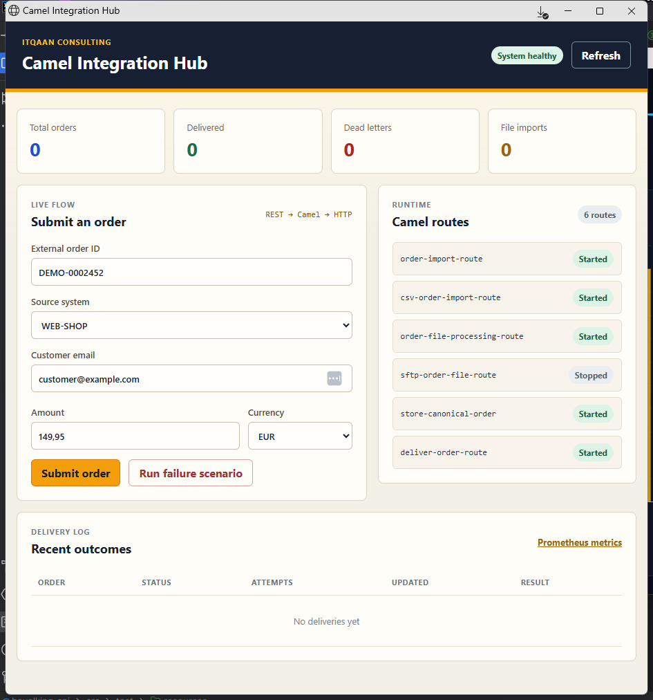
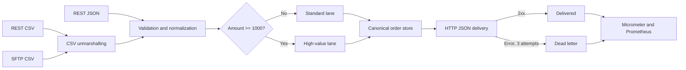

# Camel Integration Hub

Integration showcase built with Java 21, Spring Boot and Apache Camel.

The hub accepts JSON orders, CSV batches and SFTP files. Every input is normalized to one canonical model, routed through Apache Camel and delivered to an HTTP API with retry and dead-letter handling.



## Highlights

- REST, CSV and SFTP input channels
- Canonical data model and content-based routing
- External HTTP delivery with JSON serialization
- Exponential retry and dead-letter handling
- Persistent delivery history and dead-letter reprocessing
- WireMock integration tests
- Micrometer, Actuator and Prometheus metrics
- Interactive browser demo
- GitHub Actions build on Java 21

## Architecture



CSV batches use Camel CSV unmarshalling. Each valid row enters the same canonical order route as a JSON request, while invalid rows are returned in a reject report.

## Run

```powershell
mvn spring-boot:run
```

The application runs on `http://localhost:8083`.

Open `http://localhost:8083` for the browser demo. It can submit successful orders, trigger the retry/dead-letter scenario and inspect route and delivery status without additional infrastructure.

## Demo

1. Submit the prefilled order and inspect the `DELIVERED` result.
2. Select **Run failure scenario**.
3. Observe three delivery attempts and the `DEAD LETTER` result.
4. Click **Reprocess** after the simulated downstream recovery and observe `DELIVERED`.
5. Inspect the route statuses and open the Prometheus metrics link.

Import an order:

```http
POST /api/integrations/orders
Content-Type: application/json

{
  "externalOrderId": "EXT-1001",
  "sourceSystem": "web-shop",
  "customerEmail": "customer@example.com",
  "totalAmount": 149.95,
  "currency": "eur"
}
```

Inspect results:

```http
GET /api/integrations/orders
GET /api/integrations/orders/summary
GET /api/integrations/orders/deliveries
```

After an order is stored, Camel serializes the canonical model to JSON and sends an HTTP POST to the configured downstream API. Successful deliveries are recorded with status `DELIVERED`.

The downstream URL defaults to the included local demo endpoint and can be overridden with `DELIVERY_URL` for a real external service.

## Retry And Dead Letters

The delivery route uses exponential backoff. An HTTP error response is retried twice, resulting in three delivery attempts. When all attempts fail, the order remains accepted and is recorded with status `DEAD_LETTER`.

The integration tests use WireMock as the downstream API. Requests for source system `DEMO-UNAVAILABLE` receive HTTP 500, while other requests receive HTTP 202:

```http
POST /api/integrations/orders
Content-Type: application/json

{
  "externalOrderId": "FAIL-1001",
  "sourceSystem": "demo-unavailable",
  "customerEmail": "failure@example.com",
  "totalAmount": 249.00,
  "currency": "EUR"
}
```

Inspect the delivery result:

```http
GET /api/integrations/orders/dead-letters
```

The response shows status `DEAD_LETTER`, three attempts and the final HTTP error. Delivery records are stored in a file-backed H2 database and survive application restarts. Retry settings can be overridden with `DELIVERY_MAXIMUM_REDELIVERIES` and `DELIVERY_REDELIVERY_DELAY`.

Reprocess a dead letter after the downstream system has recovered:

```http
POST /api/integrations/orders/dead-letters/{integrationId}/reprocess
```

Import a CSV batch:

```http
POST /api/integrations/orders/csv
Content-Type: text/csv

externalOrderId,sourceSystem,customerEmail,totalAmount,currency
CSV-1001,web-shop,first@example.com,125.50,EUR
CSV-1002,erp,invalid-email,250.00,EUR
CSV-1003,marketplace,third@example.com,1750.00,USD
```

The response contains accepted and rejected counts, imported canonical orders and a reason for every rejected row.

## SFTP Pickup

The SFTP consumer is disabled by default so the application can run without external infrastructure. Configure the connection through `integration.sftp.*` and enable it with:

```powershell
docker compose up -d
mvn spring-boot:run "-Dspring-boot.run.profiles=sftp"
```

The route:

1. Polls `*.csv` files from the configured upload directory.
2. Uses a changed-file read lock to avoid partially written files.
3. Sends the content through the existing CSV and canonical order routes.
4. Moves processed files into `.processed`.
5. Records the filename and accepted/rejected totals.

Inspect processed file imports:

```http
GET /api/integrations/orders/file-imports
```

Upload the included demo batch:

```powershell
docker cp demo/sftp-orders.csv camel-integration-sftp:/home/camel/upload/orders.csv
```

Within a few seconds Camel picks up the file. The demo batch contains two valid orders and one rejected row. The source file is moved to the `.processed` directory on the SFTP server.

Connection settings can be overridden with `SFTP_HOST`, `SFTP_PORT`, `SFTP_USERNAME`, `SFTP_PASSWORD`, `SFTP_DIRECTORY` and `SFTP_POLL_DELAY`.

The local demo disables strict host-key checking because the disposable container generates its own key. For a real environment, set `SFTP_STRICT_HOST_KEY_CHECKING=yes` and `SFTP_USE_USER_KNOWN_HOSTS_FILE=true`, and provision the server key in the runtime user's `known_hosts` file.

## Test

```powershell
mvn test
```

WireMock starts on a random port during the integration test. The tests verify the JSON request body, successful delivery and all three HTTP attempts for a failed delivery.

## Observability

The application exposes an integration overview with current business totals and Camel route statuses:

```http
GET /api/integrations/overview
```

Technical health and metrics are available through Spring Boot Actuator:

```http
GET /actuator/health
GET /actuator/metrics
GET /actuator/metrics/integration.orders.delivery
GET /actuator/prometheus
```

Camel Micrometer instrumentation records route and exchange metrics. The custom `integration.orders.delivery` counter uses a `status` tag to distinguish delivered orders from dead letters. The Prometheus endpoint can be scraped by a monitoring platform such as Prometheus or Grafana.

## Technology

Java 21, Spring Boot 3.5, Apache Camel 4.14 LTS, WireMock, Micrometer, Prometheus, Maven and Docker Compose.
